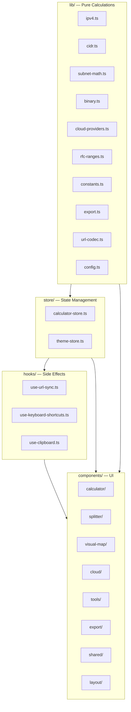
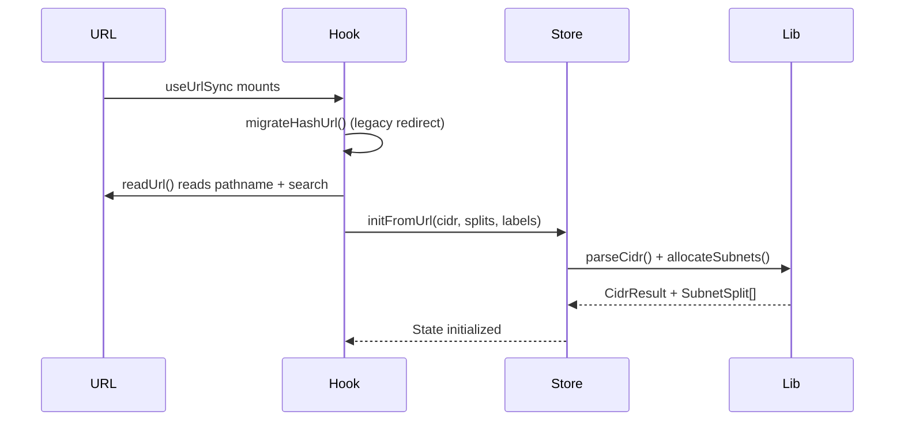
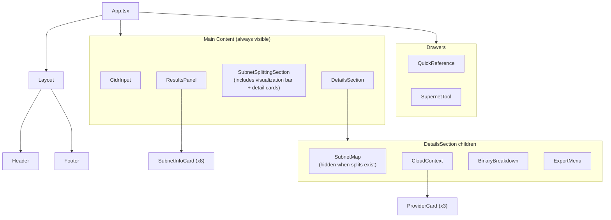

# Architecture

subnet.fit is a client-side-only application. All computation happens in the browser — there is no backend, no API calls, and no server-side rendering.

## Layer Diagram

Each layer has a strict dependency direction:

| Layer | Responsibility | Dependencies |
|-------|---------------|--------------|
| `lib/` | Pure functions. IPv4 parsing, CIDR math, subnet allocation, binary formatting, cloud provider logic, RFC detection, export formatting, URL encoding, and centralised app configuration (`config.ts`). Zero React imports. | None |
| `store/` | Zustand stores. Holds all application state and actions. Calls `lib/` functions to compute derived values. | `lib/` |
| `hooks/` | React hooks for side effects. URL hash synchronization, keyboard shortcut handling, clipboard operations. | `store/`, `lib/` |
| `components/` | React components organized by feature domain. Read from stores, call actions, render UI. | `store/`, `hooks/`, `lib/` |

## Data Flow

On mount, the flow reverses — any legacy hash URL is migrated first, then the path is read and used to initialize the store:

## Component Hierarchy

## State Management

Two Zustand stores with no middleware:

- **`calculator-store`** — All app state: active tab, CIDR input/result, splitter allocations (parent CIDR, prefix list, labels, computed splits, remaining space, available prefixes), and supernet inputs/result. Reads default CIDR from `config.ts`.
- **`theme-store`** — Dark/light theme with localStorage persistence. Reads default theme preference and storage key from `config.ts`, with support for `'system'` as the default (resolves via `prefers-color-scheme` media query).

See [State Management](state-management.md) for the full state shape and action descriptions.

## URL Routing

There is no router library. The app uses **path-based URL encoding** for state sharing:

- `/10.0.0.0/16` — Calculator mode
- `/10.0.0.0/16?split=24~Web,25~API` — Splitter mode with labels
- `/super?nets=10.0.0.0/24,10.0.1.0/24` — Supernet mode

The `useUrlSync` hook migrates legacy hash URLs on mount, reads the current path to restore state, and writes URL changes on state updates using `history.replaceState()` (no navigation events).

See [URL Sharing](url-sharing.md) for the full specification.

## Deployment

Deployed to **Cloudflare Workers** via GitHub Actions (`.github/workflows/deploy.yml`). The `wrangler.jsonc` config uses `single-page-application` not-found handling so all paths serve `index.html`, which is critical for path-based routing.
