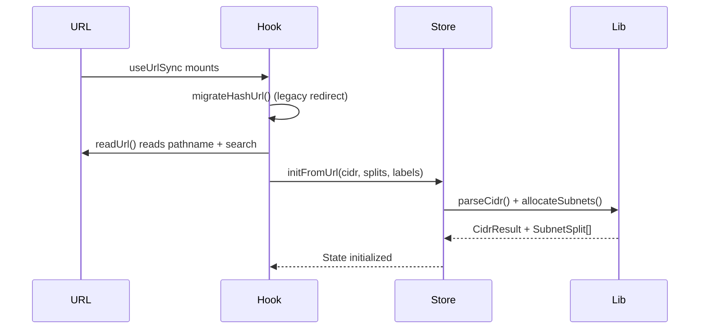
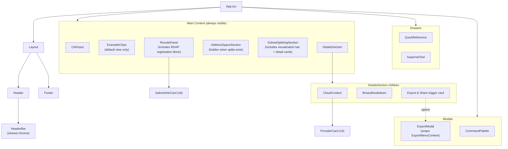
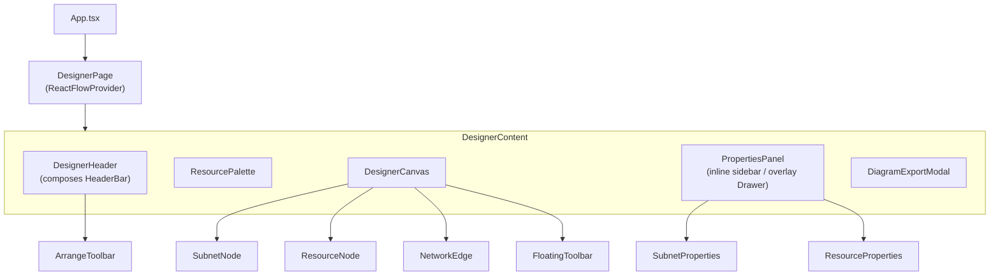

# Architecture

subnet.fit is a client-side-only application. All computation happens in the browser — there is no backend and no server-side rendering. The only external API call is the optional RDAP lookup against `rdap.org` for public IP registration data.

## Layer Diagram

```mermaid
flowchart TD
    subgraph lib["lib/ — Pure Calculations"]
        ipv4["ipv4.ts"]
        cidr["cidr.ts"]
        subnetmath["subnet-math.ts"]
        binary["binary.ts"]
        cloud["cloud-providers.ts"]
        rfc["rfc-ranges.ts"]
        rdap["rdap.ts"]
        rdapcache["rdap-cache.ts"]
        constants["constants.ts"]
        exportmod["export.ts"]
        exportdiag["export-diagram.ts"]
        urlcodec["url-codec.ts"]
        configmod["config.ts"]
        diaglayout["diagram-layout.ts"]
        diagarrange["diagram-arrange.ts"]
        reslabels["resource-labels.ts"]
        desextract["designer-state-extract.ts"]
    end

    subgraph store["store/ — State Management"]
        calcstore["calculator-store.ts"]
        designerstore["designer-store.ts"]
        themestore["theme-store.ts"]
    end

    subgraph hooks["hooks/ — Side Effects"]
        urlsync["use-url-sync.ts"]
        designerurlsync["use-designer-url-sync.ts"]
        calchref["use-calculator-href.ts"]
        diagrampersist["use-diagram-persistence.ts"]
        designershortcuts["use-designer-shortcuts.ts"]
        keyboard["use-keyboard-shortcuts.ts"]
        clipboard["use-clipboard.ts"]
        rdaplookup["use-rdap-lookup.ts"]
    end

    subgraph components["components/ — UI"]
        calculator["calculator/"]
        splitter["splitter/"]
        designer["designer/"]
        visualmap["visual-map/"]
        cloudcomp["cloud/"]
        whois["whois/"]
        tools["tools/"]
        exportcomp["export/"]
        shared["shared/"]
        layout["layout/"]
    end

    ipv4 --> urlcodec

    lib --> store
    store --> hooks
    hooks --> components
    lib --> components
    store --> components
```

Each layer has a strict dependency direction:

| Layer | Responsibility | Dependencies |
|-------|---------------|--------------|
| `lib/` | Pure functions. IPv4 parsing, CIDR math, subnet allocation, binary formatting, cloud provider logic, RFC detection, RDAP response parsing and caching, export formatting (data, IaC, diagram), URL encoding, diagram layout/arrange algorithms, resource type labels (`resource-labels.ts`), and centralised app configuration (`config.ts`). Zero React imports. | None |
| `store/` | Zustand stores. Holds all application state and actions. `calculator-store` for the main app, `designer-store` for the network diagram, `theme-store` for dark/light mode. Calls `lib/` functions to compute derived values. | `lib/` |
| `hooks/` | React hooks for side effects. URL synchronization (with bare IP normalization), designer URL sync, calculator href generation from designer state, diagram persistence (localStorage), keyboard shortcuts (calculator and designer), clipboard operations, RDAP lookups. | `store/`, `lib/` |
| `components/` | React components organized by feature domain. Read from stores, call actions, render UI. `shared/` holds the design-system primitives (`Button`, `IconButton`, `Input`/`Select`/`Textarea`, `SectionLabel`/`LabelValue`, `SegmentedControl`, `Modal`, `Drawer`, `ThemeToggle`, `Badge`, `AnimatedCard`, `CollapsibleSection`, `CopyButton`, and the `motion.ts` animation presets) that all feature components compose. | `store/`, `hooks/`, `lib/` |

## Data Flow

On mount, the flow reverses — any legacy hash URL is migrated first, then the path is read and used to initialize the store:

## Component Hierarchy

### Calculator Layout

Both app shells share the `HeaderBar` chrome in `src/components/layout/HeaderBar.tsx` — the calculator `Header` composes it contained (`max-w-6xl`), the `DesignerHeader` composes it full-width with a bottom border. Logo size, padding, and the actions slot are identical in both.

The calculator export lives in a shared `Modal` (`src/components/export/ExportModal.tsx`) with tabs Data / CLI / Terraform / Share, opened from the "Export & Share" trigger card in the details area, the `open-export` command-palette command, or `Cmd/Ctrl+E`. The `CommandPalette` renders inside `Modal chrome="none"` and owns its own chrome.

### Designer Layout

When the pathname starts with `/designer`, `App.tsx` renders `<DesignerPage>` instead of the calculator layout.

The designer adapts to viewport width rather than blocking small screens. Below `md` (768px) the palette becomes an overlay `Drawer` opened by a floating "Add" button (palette items use tap-to-place), and the properties panel renders as `PropertiesPanel variant="overlay"` inside a `Drawer`. Below 480px a dismissible soft banner (sessionStorage-backed) notes the designer works best on a larger screen.

Cloud provider icons are auto-generated from official SVGs via `scripts/generate-icons.mjs`. Source SVGs live in `icons/{provider}/`; generated TSX components are output to `src/components/designer/icons/{provider}/`. Resource type labels used by properties panels are centralised in `src/lib/resource-labels.ts`.

See the [Network Designer documentation](network-designer.md) for full details.

## State Management

Three Zustand stores with no middleware:

- **`calculator-store`** — All calculator/splitter/supernet state: CIDR input/result, splitter allocations (prefix list, labels, computed splits, remaining space, available prefixes), supernet inputs/result, active drawer, command palette, export modal (`exportModalOpen`), the supernet → calculator `handoff` (undo notice), and input mode. Reads default CIDR from `config.ts`.
- **`designer-store`** — Network diagram state: nodes, edges, selection (single and multi), palette visibility, dirty flag, export modal visibility. Actions for node CRUD, color updates, layout initialization, and localStorage persistence.
- **`theme-store`** — Dark/light theme with localStorage persistence. Reads default theme preference and storage key from `config.ts`, with support for `'system'` as the default (resolves via `prefers-color-scheme` media query).

See [State Management](state-management.md) for the full state shape and action descriptions.

## URL Routing

There is no router library. The app uses **path-based URL encoding** for state sharing:

- `/10.0.0.0/16` — Calculator mode
- `/10.0.0.0/16?split=24~Web,25~API` — Splitter mode with labels
- `/super?nets=10.0.0.0/24,10.0.1.0/24` — Supernet mode

The `useUrlSync` hook migrates legacy hash URLs on mount, reads the current path to restore state, and writes URL changes on state updates using `history.replaceState()` (no navigation events).

Navigation between calculator and designer is bidirectional and state-preserving. When navigating Calculator → Designer, the Header link, command palette, and SplitterToolbar build `/designer?from=&split=` URLs from calculator store state; `useDesignerUrlSync` merges new subnets into any saved diagram with the same VPC CIDR (so user-added resources are never overwritten). When navigating Designer → Calculator, the `useCalculatorHref()` hook extracts CIDR and splits from diagram nodes via `extractDesignerState()` and encodes them into a calculator URL using `encodeState()` — in the designer the logo is the single state-preserving back link.

The designer URL is kept canonical: `buildDesignerUrl()` in `src/lib/designer-state-extract.ts` derives `/designer?from=&split=&provider=` from the current diagram, and both `useDesignerUrlSync` (after processing `?from=` or `?d=` share params) and `useDiagramPersistence` (on every debounced save) write it via `history.replaceState()`, so a refresh or bookmark keeps the diagram context.

See [URL Sharing](url-sharing.md) for the full specification.

## Deployment

Deployed to **Cloudflare Workers** via GitHub Actions (`.github/workflows/deploy.yml`). The Worker (`worker/index.ts`) handles four concerns:

1. **OG image generation** — `/og/*` routes render dynamic PNG images using `satori` (SVG) + `@resvg/resvg-wasm` (PNG), with 7-day cache headers
2. **XML Sitemaps** — `/sitemap.xml` (index), `/sitemap-pages.xml`, `/sitemap-cidr.xml` (~14k RFC 1918 CIDR URLs), `/sitemap-splitter.xml` (~25 curated split examples), `/sitemap-supernet.xml` (~20 aggregation examples). Generated dynamically in `worker/sitemap.ts` with 24h cache headers.
3. **Static assets** — requests with file extensions pass through to `env.ASSETS.fetch()`
4. **SPA routing + meta tags** — all other paths serve `index.html` via `env.ASSETS.fetch()`, with `HTMLRewriter` injecting dynamic `og:*`/`twitter:*` meta tags, `<link rel="canonical">` URLs (normalized to network address), and `<script type="application/ld+json">` structured data (WebApplication + FAQPage schemas) based on the URL (CIDR, splitter, supernet, designer)

### SEO Infrastructure

- **`public/robots.txt`** — allows all crawlers, points to sitemap
- **`worker/sitemap.ts`** — generates tiered XML sitemaps for all RFC 1918 CIDR pages
- **`worker/json-ld.ts`** — computes JSON-LD structured data per page type (WebApplication, FAQPage)
- **`worker/meta-tags.ts`** — computes and injects `<title>`, `<meta>`, `<link rel="canonical">`, and JSON-LD via HTMLRewriter

The `wrangler.jsonc` config uses Worker+Assets hybrid mode (`main` + `assets.binding: "ASSETS"`). Module rules bundle TTF fonts as `Data` and WASM as `CompiledWasm`.
