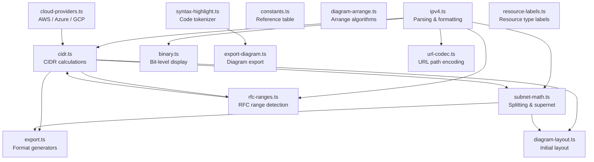

# Calculation Engine

All calculation logic lives in `src/lib/` as pure functions with zero React dependencies. Every module operates on 32-bit unsigned integers using `>>> 0` to ensure correct unsigned behavior in JavaScript.

## Module Dependencies



## ipv4.ts — IPv4 Parsing & Formatting

Handles conversion between dotted-decimal strings and 32-bit unsigned integers.

### Exports

| Function | Signature | Description |
|----------|-----------|-------------|
| `parseIPv4` | `(str: string) => number \| null` | Parse dotted-decimal to 32-bit uint. Returns `null` on invalid input. |
| `ipv4ToString` | `(num: number) => string` | Convert 32-bit uint back to dotted-decimal. |
| `isValidIPv4` | `(str: string) => boolean` | Convenience wrapper around `parseIPv4`. |
| `ipv4ToBinary` | `(num: number) => string` | Returns 32-character binary string (zero-padded). |
| `ipv4ToDottedBinary` | `(num: number) => string` | Binary with dots between octets (e.g. `00001010.00000000.00000000.00000000`). |
| `inferDefaultPrefix` | `(ip: number) => number` | Infer a default prefix from trailing zero octets: `.0.0.0` → `/8`, `.0.0` → `/16`, `.0` → `/24`, otherwise `/32`. |
| `parseIPv4WithCidr` | `(input: string) => { ip: number; prefix: number } \| null` | Parse `ip/prefix` format. Bare IPs use `inferDefaultPrefix()` to determine the prefix. |

### Validation Rules

- Exactly 4 octets separated by `.`
- Each octet: 1–3 digits, value 0–255
- Prefix: 1–2 digits, value 0–32

## cidr.ts — CIDR Calculations

The core module. Parses CIDR notation and computes all derived values.

### CidrResult Type

```typescript
interface CidrResult {
  input: string
  networkAddress: string
  broadcastAddress: string
  netmask: string
  wildcardMask: string
  prefixLength: number
  firstHost: string
  lastHost: string
  totalAddresses: number
  usableHosts: number
  binaryNetmask: string
  binaryNetwork: string
  binaryBroadcast: string
  binaryFirstHost: string
  binaryLastHost: string
  ipClass: 'A' | 'B' | 'C' | 'D' | 'E'
  isPrivate: boolean
  rfcType: string | null
  cloudContext: CloudContext
  networkNum: number
  broadcastNum: number
  netmaskNum: number
}
```

### Exports

| Function | Signature | Description |
|----------|-----------|-------------|
| `getNetmask` | `(prefix: number) => number` | Compute netmask as uint32. Uses `(~0 << (32 - prefix)) >>> 0`. |
| `getWildcardMask` | `(prefix: number) => number` | Bitwise inverse of netmask. |
| `getNetworkAddress` | `(ip: number, prefix: number) => number` | `ip & netmask` — first address in the range. |
| `getBroadcastAddress` | `(ip: number, prefix: number) => number` | `ip \| wildcard` — last address in the range. |
| `getIPClass` | `(ip: number) => 'A' \| 'B' \| 'C' \| 'D' \| 'E'` | Classful IP class based on first octet. |
| `isPrivateIP` | `(ip: number) => boolean` | Checks RFC 1918 ranges (10/8, 172.16/12, 192.168/16). |
| `getTotalAddresses` | `(prefix: number) => number` | `2^(32 - prefix)`. |
| `getUsableHosts` | `(prefix: number) => number` | Total minus 2 (network + broadcast). /32 returns 1, /31 returns 2. |
| `parseCidr` | `(input: string) => CidrResult \| null` | Full parse: calls all above functions plus `detectRfcType` and `calculateCloudContext`. |
| `cidrToString` | `(networkNum: number, prefix: number) => string` | Format `ip/prefix` string from numeric values. |

### parseCidr Flow

1. `parseIPv4WithCidr()` extracts IP and prefix
2. Compute netmask, network address, broadcast address
3. Derive first/last host (special-cased for /31 and /32)
4. Generate dotted-binary strings for all addresses
5. Detect IP class, private status, RFC type, and cloud context
6. Return complete `CidrResult`

## subnet-math.ts — Splitting & Supernet

### SubnetSplit Type

```typescript
interface SubnetSplit {
  cidr: string
  prefixLength: number
  networkAddress: string
  broadcastAddress: string
  firstHost: string
  lastHost: string
  size: number
  usableHosts: number
  label: string
  color: string
}
```

### Exports

| Function | Signature | Description |
|----------|-----------|-------------|
| `allocateSubnets` | `(parentCidr, prefixLengths, labels?) => SubnetSplit[] \| null` | Sequentially allocate subnets within a parent CIDR. Aligns to subnet boundaries. Returns `null` if allocation overflows. |
| `getRemainingSpace` | `(parentCidr, splits) => number` | Count of unallocated addresses in parent. |
| `getAvailablePrefixes` | `(parentCidr, currentSplits) => number[]` | List of prefix lengths that still fit. |
| `findSmallestContainingCidr` | `(cidrs: string[]) => string \| null` | Find the smallest single CIDR that contains all inputs (supernet). |

### Sequential Allocation Algorithm

1. Start at the parent network address
2. For each requested prefix length:
   - Compute the child subnet size (`2^(32 - childPrefix)`)
   - Align `currentAddress` to the nearest valid subnet boundary using `currentAddress & alignMask`
   - If the aligned address is before `currentAddress`, advance by one subnet size
   - Check that the child broadcast doesn't exceed the parent broadcast
   - Record the split and advance `currentAddress` past the child broadcast
3. Return `null` if any child doesn't fit

### Supernet Algorithm

1. Find the minimum network address and maximum broadcast address across all inputs
2. Walk prefix lengths from /32 down to /0
3. Return the first (smallest) prefix where `network <= minIp` and `broadcast >= maxIp`

## binary.ts — Bit-Level Display

### BinaryBit Type

```typescript
interface BinaryBit {
  value: '0' | '1'
  type: 'network' | 'host'
  index: number          // 0–31 bit position
}
```

### Exports

| Function | Signature | Description |
|----------|-----------|-------------|
| `getBinaryBits` | `(ip: number, prefixLength: number) => BinaryBit[]` | Returns 32 `BinaryBit` objects, each tagged as network or host based on the prefix boundary. |
| `formatBinaryWithDots` | `(bits: BinaryBit[]) => BinaryBit[][]` | Groups into 4 octets of 8 bits for display. |

## cloud-providers.ts — Cloud Provider Constraints

### Types

```typescript
interface CloudProviderInfo {
  id: string
  name: string                    // e.g. "Amazon Web Services"
  shortName: string               // e.g. "AWS"
  reservedAddresses: number       // addresses reserved by the provider
  reservedDescription: string[]   // per-address explanation
  minPrefix: number               // smallest allowed prefix (largest network)
  maxPrefix: number               // largest allowed prefix (smallest network)
  vpcMaxCidr: string              // human-readable max size
  color: string                   // brand color hex
}

interface CloudProviderResult {
  provider: CloudProviderInfo
  usableHosts: number
  isValidSubnet: boolean
  tooSmall: boolean
  tooLarge: boolean
}

interface CloudContext {
  aws: CloudProviderResult
  azure: CloudProviderResult
  gcp: CloudProviderResult
}
```

### Provider Configuration

| Provider | Reserved | Min Prefix | Max Prefix | Brand Color |
|----------|----------|------------|------------|-------------|
| AWS | 5 | /16 | /28 | `#cb4b16` (Solarized orange) |
| Azure | 5 | /8 | /29 | `#268bd2` (Solarized blue) |
| GCP | 4 | /8 | /29 | `#6c71c4` (Solarized violet) |

### Exports

| Function | Signature | Description |
|----------|-----------|-------------|
| `calculateCloudContext` | `(prefix: number) => CloudContext` | Compute usable hosts and validity for all three providers. |

## rfc-ranges.ts — RFC Range Detection

Identifies which RFC-defined special-purpose range an IP falls into.

### RfcRange Type

```typescript
interface RfcRange {
  cidr: string
  name: string           // e.g. "Private (Class A)"
  rfc: string            // e.g. "RFC 1918"
  description: string
  color: string
  networkNum: number     // lazily computed
  broadcastNum: number   // lazily computed
}
```

### Defined Ranges

17 ranges are defined, covering: This Network (RFC 1122), Private Class A/B/C (RFC 1918), CGNAT (RFC 6598), Loopback (RFC 1122), Link-Local (RFC 3927), IETF Protocol (RFC 6890), Documentation TEST-NET 1/2/3 (RFC 5737), 6to4 Relay (RFC 7526), Benchmarking (RFC 2544), Multicast (RFC 5771), MCAST-TEST-NET (RFC 6676), Reserved (RFC 1112), and Broadcast (RFC 919).

### Lazy Caching

`getRfcRanges()` parses range definitions on first call and caches the result in a module-level variable. Subsequent calls return the cached array.

### Exports

| Function | Signature | Description |
|----------|-----------|-------------|
| `getRfcRanges` | `() => RfcRange[]` | Return all 17 parsed RFC ranges (lazy-initialized). |
| `detectRfcType` | `(ip: number) => string \| null` | First matching range's `"RFC — Name"` string, or `null` for public IPs. |

## constants.ts — Reference Table

Pre-computes the `SUBNET_REFERENCE_TABLE`: an array of 33 entries (prefix 0–32), each with:

```typescript
interface SubnetReference {
  prefix: number
  netmask: string
  wildcardMask: string
  totalAddresses: number
  usableHosts: number
}
```

Generated once at module load time using the same bitwise math as `cidr.ts`.

## export.ts — Format Generators

Transforms `CidrResult` (and optional `SubnetSplit[]`) into various output formats.

### Exports

| Function | Signature | Output |
|----------|-----------|--------|
| `toJSON` | `(result, splits?) => string` | Pretty-printed JSON object |
| `toCSV` | `(result, splits?) => string` | CSV with header row |
| `toTerraformAws` | `(result, splits?) => string` | AWS VPC + Subnet HCL |
| `toTerraformAzure` | `(result, splits?) => string` | Azure Resource Group + VNet + Subnet HCL |
| `toTerraformGcp` | `(result, splits?) => string` | GCP Network + Subnetwork HCL |

### export-cli.ts — CLI Command Generators

| Function | Signature | Output |
|----------|-----------|--------|
| `toAwsCli` | `(result, splits?) => string` | `aws ec2 create-vpc` + subnet commands |
| `toAzureCli` | `(result, splits?) => string` | `az network vnet create` + subnet commands |
| `toGcloudCli` | `(result, splits?) => string` | `gcloud compute networks create` + subnet commands |

### Label Sanitization

IaC and CLI formats sanitize labels for use as identifiers:
- Terraform: `label.toLowerCase().replace(/[^a-z0-9]+/g, '_').replace(/^_|_$/g, '')`
- CLI: `label.toLowerCase().replace(/[^a-z0-9]+/g, '-').replace(/^-|-$/g, '')`

## diagram-layout.ts — Initial Diagram Layout

Generates an initial network diagram from a parent `CidrResult` and `SubnetSplit[]` array. Used when navigating to `/designer?from=...&split=...`.

### Constants

| Constant | Value | Description |
|----------|-------|-------------|
| `NODE_WIDTH` | 220 | Width of each node in pixels |
| `NODE_HEIGHT` | 100 | Height of each node in pixels |
| `COLUMN_GAP` | 40 | Horizontal gap between columns |
| `ROW_GAP` | 80 | Vertical gap between rows |
| `COLUMNS` | 3 | Number of columns in the subnet grid |

### Exports

| Function | Signature | Description |
|----------|-----------|-------------|
| `generateInitialLayout` | `(parentResult: CidrResult, splits: SubnetSplit[]) => { nodes, edges }` | Creates Internet Gateway → VPC → Subnet grid with `networkEdge` connections. |

### Layout Structure

```
Internet Gateway (resourceNode, top center)
        │ networkEdge
   VPC / Network (resourceNode, parent CIDR label)
        │ networkEdge (one per subnet)
   ┌────┼────┐
Subnet  Subnet  Subnet   (subnetNode, 3-column grid)
```

## diagram-arrange.ts — Arrange Algorithms

Pure functions for reorganizing diagram nodes. All functions are generic (`<T extends Node>`) to preserve typed node data through transformations.

### Exports

| Function | Signature | Description |
|----------|-----------|-------------|
| `autoLayout` | `(nodes, edges) => nodes` | Hierarchical BFS layout. Finds root nodes (no incoming edges), layers outward via BFS, places in 3-column grid rows. Centers layers with fewer than 3 nodes. Appends disconnected nodes to the last layer. |
| `alignNodes` | `(nodes, selectedIds, direction) => nodes` | Aligns 2+ selected nodes. Direction: `left`, `right`, `top`, `bottom`, `center-h`, `center-v`. Snaps to min/max or midpoint of bounding box. |
| `distributeNodes` | `(nodes, selectedIds, axis) => nodes` | Distributes 3+ selected nodes evenly. Axis: `horizontal` or `vertical`. Sorts by position, spaces evenly between first and last. |

### AlignDirection Type

```typescript
type AlignDirection = 'left' | 'right' | 'top' | 'bottom' | 'center-h' | 'center-v'
```

## export-diagram.ts — Diagram Export

Generates exportable artifacts from diagram nodes and edges.

### Exports

| Function | Signature | Description |
|----------|-----------|-------------|
| `diagramToPng` | `(element: HTMLElement, isDark: boolean) => Promise<Blob>` | Renders the React Flow DOM element to a PNG blob at 2x pixel ratio using `html-to-image`. |
| `diagramToSvg` | `(element: HTMLElement, isDark: boolean) => Promise<Blob>` | Renders to SVG blob. |
| `diagramToJson` | `(nodes, edges) => string` | Returns `JSON.stringify({ nodes, edges, version: 1 }, null, 2)`. |
| `diagramToDrawio` | `(nodes, edges) => string` | Builds draw.io-compatible `<mxfile>` XML. Subnet nodes → rounded rects with fill color. Resource nodes → shapes mapped by type. Edges → orthogonal style with cyan stroke. |

### draw.io Shape Mapping

| Resource Type | draw.io Shape |
|---------------|---------------|
| `internet-gateway` | `ellipse` |
| `cloud` | `cloud` |
| `vpc` | `mxgraph.aws3.virtual_private_cloud` |
| `router`, `switch` | `hexagon` |
| `firewall` | `trapezoid` |
| `database` | `cylinder3` |
| `load-balancer` | `triangle` |
| `server` | Default rectangle |

## resource-labels.ts — Resource Type Labels

Centralised human-readable labels for all resource types across all providers and the generic palette. Both `CloudResourceProperties` and `ResourceProperties` panels import from this single file rather than maintaining their own inline maps.

### Exports

| Export | Type | Description |
|--------|------|-------------|
| `RESOURCE_TYPE_LABELS` | `Record<string, string>` | Maps resource keys (e.g. `azure-vm`, `aws-ec2`, `router`) to display labels (e.g. `Virtual Machine`, `EC2 Instance`, `Router`) |

Organised by section: Generic, AWS, Azure, GCP. To add a new resource, add a single line here and register it in the palette and icon map.

## url-codec.ts — URL Path Encoding

See [URL Sharing](url-sharing.md) for the full specification. Key exports:

| Function | Signature | Description |
|----------|-----------|-------------|
| `encodeState` | `(state: UrlState) => string` | Encode state to URL path + query string. |
| `decodeState` | `(pathname: string, search: string) => UrlState \| null` | Parse pathname and search string to state object. |
| `updateUrl` | `(state: UrlState) => void` | Write encoded state to URL via `history.replaceState`. |
| `readUrl` | `() => UrlState \| null` | Read and decode current pathname + search. |
| `migrateHashUrl` | `() => boolean` | Redirect legacy hash-based URLs to new path format. |
