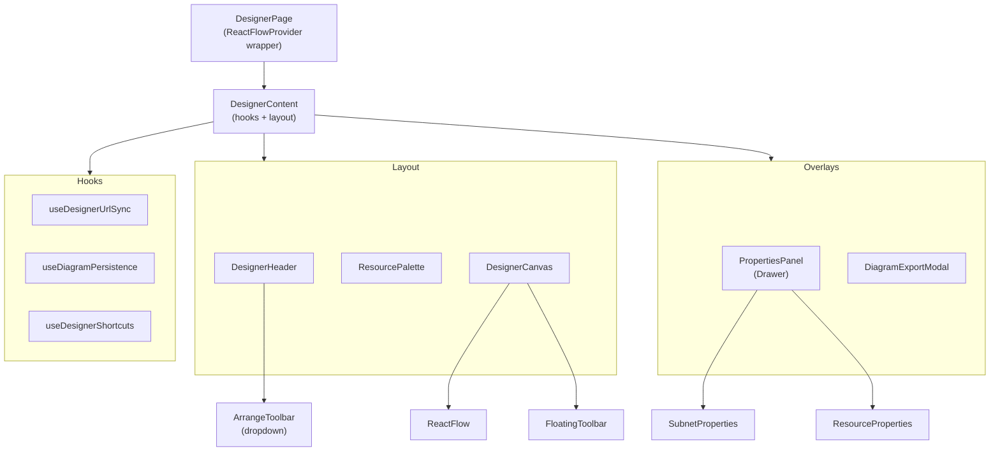
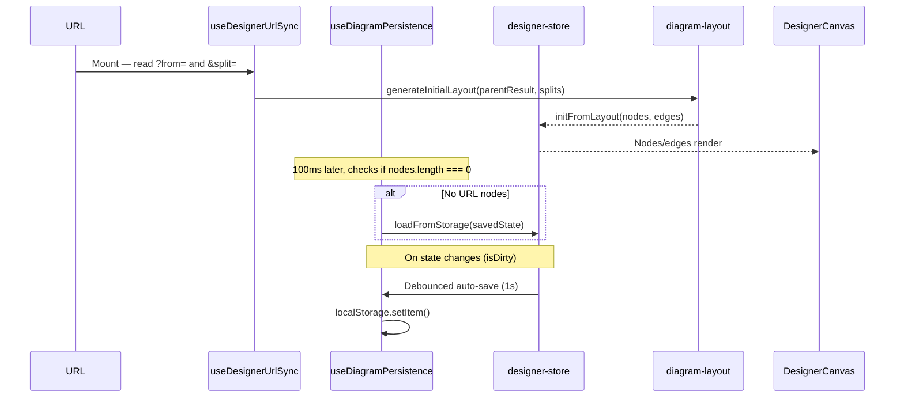

# Network Designer

The Network Designer is a visual drag-and-drop diagram editor for network topologies, accessible at `/designer`. It uses React Flow (`@xyflow/react`) for the canvas and Zustand for state management.

## Overview

The designer allows users to:
- Build network topology diagrams with subnet and resource nodes
- Auto-generate layouts from splitter data via URL parameters
- Edit node properties (labels, colors) in a side panel
- Arrange nodes with auto-layout, alignment, and distribution tools
- Export diagrams as PNG, SVG, JSON, or draw.io XML
- Persist diagrams to localStorage across sessions

## Routing & Initialization

The designer is rendered when the URL pathname starts with `/designer`:

```
/designer                                    — Empty canvas (loads from localStorage if available)
/designer?from=10.0.0.0/16&split=24~Web,25~API  — Auto-generate from splitter data
```

Detection happens in `App.tsx`:

```typescript
pathname.startsWith('/designer') ? <DesignerPage /> : <Layout />
```

### Initialization Priority

1. **URL parameters** — `useDesignerUrlSync()` reads `?from=` and `&split=` params, calls `generateInitialLayout()` to create nodes/edges
2. **localStorage** — If no URL params produced nodes, `useDiagramPersistence()` loads from `subnet-designer-state` key (100ms deferred to let URL sync run first)
3. **Empty canvas** — If neither source has data, the canvas starts empty

## Component Architecture



### DesignerPage (`src/components/designer/DesignerPage.tsx`)

Top-level component. Wraps everything in `<ReactFlowProvider>`. Adapts to viewport width rather than blocking small screens: below 768px the palette becomes an overlay Drawer opened by a floating "Add" button (sheet items always tap-to-place via `forceTap`) and the properties panel renders as an overlay (`variant="overlay"`); below 480px a dismissible, sessionStorage-backed soft banner notes the designer works best on a larger screen. Renders:
- `DesignerHeader` — composes the shared `HeaderBar`; toolbar with arrange, export, delete, clear, theme toggle. The logo is the single state-preserving back link to the calculator
- `ResourcePalette` — collapsible left sidebar with draggable resource items (or an overlay sheet below 768px)
- `DesignerCanvas` — React Flow canvas with nodes, edges, minimap, controls, background, floating toolbar
- `PropertiesPanel` — inline right sidebar (overlay Drawer below 768px) for editing selected nodes
- `DiagramExportModal` — built on the shared `Modal` with a `SegmentedControl` tab bar (Data | Image | Diagrams.net | Share)

### DesignerCanvas (`src/components/designer/DesignerCanvas.tsx`)

Wraps the `<ReactFlow>` component with:
- **Node types**: `subnetNode` (SubnetNode), `resourceNode` (ResourceNode)
- **Edge types**: `networkEdge` (NetworkEdge)
- **Default edge options**: `{ type: 'networkEdge', animated: false }`
- **Drag-and-drop**: `onDragOver` + `onDrop` handlers for resource palette items
- **Selection tracking**: `onSelectionChange` populates both `selectedNodeId` (first) and `selectedNodeIds` (all) in the store
- **Controls**: MiniMap, Controls, Background (dots at 24px), FloatingToolbar

## Node Types

### SubnetNode (`src/components/designer/nodes/SubnetNode.tsx`)

Displays a subnet block with:
- Left-edge color bar (from `data.color`)
- Editable label (via `NodeLabel`)
- CIDR notation in monospace
- Host count and network address
- Top (target) and bottom (source) connection handles

Data shape: `SubnetNodeData` — `{ type: 'subnet', cidr, label, color, hosts, networkAddress, broadcastAddress }`

### ResourceNode (`src/components/designer/nodes/ResourceNode.tsx`)

Displays a generic network resource with:
- Icon from `RESOURCE_ICONS` map (based on `data.resourceType`)
- Editable label
- Handles on all four sides (top, bottom, left, right)

Data shape: `ResourceNodeData` — `{ type: 'resource', resourceType, label }`

### Resource Types

| Type | Label | Icon |
|------|-------|------|
| `router` | Router | RouterIcon (cyan) |
| `switch` | Switch | SwitchIcon (blue) |
| `firewall` | Firewall | FirewallIcon (red) |
| `server` | Server | ServerIcon (base01) |
| `database` | Database | DatabaseIcon (violet) |
| `load-balancer` | Load Balancer | LoadBalancerIcon (yellow) |
| `internet-gateway` | Internet Gateway | InternetGatewayIcon (green) |
| `cloud` | Cloud | CloudIcon (base0) |
| `vpc` | VPC / VNet | VpcIcon (orange) |

Icons are defined in `src/components/designer/icons/NetworkIcons.tsx` as SVG components.

## Custom Edges

### NetworkEdge (`src/components/designer/edges/NetworkEdge.tsx`)

Replaces the default React Flow edges. Uses `BaseEdge` + `getSmoothStepPath` with:
- Stroke color: `#2aa198` (Solarized cyan)
- Stroke width: 2px (unselected), 3px (selected)
- Opacity: 0.7 (unselected), 1.0 (selected)
- Border radius: 8px on smooth step corners

All edges (auto-generated from layout, created via `onConnect`, or loaded from storage) use type `'networkEdge'`.

## Properties Panel

### PropertiesPanel (`src/components/designer/PropertiesPanel.tsx`)

An inline right sidebar (320px wide) that slides open when `selectedNodeId !== null`. Uses `motion/react` `AnimatePresence` for animated width transitions. Lives inside the flex row alongside `ResourcePalette` and `DesignerCanvas`, so it never overlays the header. Includes a Delete Node button in the footer.

### SubnetProperties (`src/components/designer/panels/SubnetProperties.tsx`)

| Field | Type | Description |
|-------|------|-------------|
| CIDR | Read-only | Monospace display of the subnet CIDR |
| Label | Text input | Editable, calls `updateNodeLabel()` |
| Color | Swatch grid | 8 Solarized accent circles (32x32px), calls `updateNodeColor()` |
| Usable Hosts | Read-only | Formatted host count |
| Network Address | Read-only | Monospace |
| Broadcast Address | Read-only | Monospace |

Color picker swatches: Cyan, Blue, Magenta, Green, Yellow, Violet, Orange, Red.

### ResourceProperties (`src/components/designer/panels/ResourceProperties.tsx`)

| Field | Type | Description |
|-------|------|-------------|
| Icon | Preview | Large (48x48) icon from `RESOURCE_ICONS` |
| Type | Read-only | Human-readable resource type label |
| Label | Text input | Editable, calls `updateNodeLabel()` |

## Arrange Tools

### Layout Algorithms (`src/lib/diagram-arrange.ts`)

Pure functions (zero React) for organizing nodes on the canvas.

#### autoLayout(nodes, edges)

Hierarchical BFS layout:
1. Build incoming/children adjacency maps from edges
2. Find root nodes (no incoming edges)
3. BFS outward to assign layers
4. Place each layer in rows using a 3-column grid (NODE_WIDTH=220, COLUMN_GAP=40, ROW_GAP=80)
5. Center layers that have fewer than 3 nodes
6. Append any disconnected nodes to the last layer

Returns updated nodes with new positions.

#### alignNodes(nodes, selectedIds, direction)

Aligns 2+ selected nodes along a direction:
- `left` / `right` / `top` / `bottom` — snap to min/max position
- `center-h` / `center-v` — snap to midpoint of bounding box

#### distributeNodes(nodes, selectedIds, axis)

Distributes 3+ selected nodes evenly:
- `horizontal` — sort by x, space evenly between first and last
- `vertical` — sort by y, space evenly between first and last

### ArrangeToolbar (`src/components/designer/ArrangeToolbar.tsx`)

A dropdown menu in the DesignerHeader with three sections:
- **Auto Layout** button — rearranges all nodes hierarchically
- **Align** — 6 icon buttons in a 3x2 grid (enabled when 2+ nodes selected)
- **Distribute** — 2 buttons for horizontal/vertical (enabled when 3+ nodes selected)

Closes on outside click.

## Auto-Generated Layout

### generateInitialLayout (`src/lib/diagram-layout.ts`)

Creates an initial diagram from a parent `CidrResult` and `SubnetSplit[]`:

```
Internet Gateway (top center)
        |
   VPC / Network (parent CIDR)
        |
   Subnet nodes in a 3-column grid
```

Constants: `NODE_WIDTH=220`, `NODE_HEIGHT=100`, `COLUMN_GAP=40`, `ROW_GAP=80`, `COLUMNS=3`.

Generates `resourceNode` entries for the Internet Gateway and VPC, `subnetNode` entries for each split, and `networkEdge` connections between them.

## Export

### Export Functions (`src/lib/export-diagram.ts`)

| Function | Output | Method |
|----------|--------|--------|
| `diagramToPng(element, isDark)` | PNG Blob | `html-to-image` `toPng()` with 2x pixel ratio |
| `diagramToSvg(element, isDark)` | SVG Blob | `html-to-image` `toSvg()` |
| `diagramToJson(nodes, edges)` | JSON string | `JSON.stringify({ nodes, edges, version: 2 }, null, 2)` |
| `diagramToDrawio(nodes, edges)` | XML string | Builds `<mxfile>` with rich HTML labels and embedded SVG icons |

PNG/SVG exports use the `backgroundColor` from the current theme (`#002b36` dark, `#fdf6e3` light). The element passed is the `.react-flow` DOM node.

### draw.io XML Format

The draw.io export generates high-fidelity `<mxfile>` XML that closely mirrors the designer view:
- **VPC containers** → `html=1` rich labels with provider badge (e.g. "VNET"), label, and CIDR. Provider-specific border colors/styles (Azure solid, others dashed)
- **Subnet containers** → `html=1` labels with colored dot indicator, label, CIDR, and hosts badge. Dotted borders
- **Cloud resources** → Embedded SVG icons via `shape=image` with data URIs from `drawio-icons.ts`. Falls back to styled rectangles
- **Legacy nodes** → Shape-mapped by resourceType or embedded generic SVG icons
- **Edges** → Curved routing with `orthogonalLoop=1;jettySize=auto;curved=1` and `strokeColor=#2aa198`
- **Background** → `background="#002b36"` dark theme on the graph model
- All text values are XML-escaped

### DiagramExportModal (`src/components/designer/DiagramExportModal.tsx`)

A centered modal overlay with three tabs:
- **Image** — PNG and SVG download buttons
- **JSON** — Code preview with syntax highlighting + copy button
- **draw.io** — XML code preview with syntax highlighting + download as `.drawio` file

Opened via `setExportOpen(true)` in the designer store. Triggered by:
- Header "Export" button
- Floating toolbar "Export" button
- `Cmd/Ctrl+E` keyboard shortcut

### XML Syntax Highlighting

Added to `src/lib/syntax-highlight.ts` as the `'xml'` language type:
- Tags (`<tagname`) → `keyword`
- Attributes (`attr=`) → `property`
- Strings (`"value"`) → `string`
- Comments (`<!-- -->`) → `comment`
- Numbers → `number`
- Punctuation (`<>/=`) → `punctuation`

## Persistence

### useDiagramPersistence (`src/hooks/use-diagram-persistence.ts`)

Provides auto-save and auto-load for diagram state.

**localStorage key:** `subnet-designer-state`

**Save behavior:**
- Triggers on any `isDirty` state change (node moves, adds, edits, edge changes)
- Debounced at 1 second to avoid excessive writes
- Serializes `{ nodes, edges, version: 1 }`

**Load behavior:**
- Runs once on mount, deferred 100ms to let URL sync initialize first
- Only loads if no nodes were created by URL params
- Validates the stored data structure before applying

**Clear behavior:**
- `clearDiagram()` in the store also calls `localStorage.removeItem(STORAGE_KEY)`

## Keyboard Shortcuts

### useDesignerShortcuts (`src/hooks/use-designer-shortcuts.ts`)

Follows the same pattern as `use-keyboard-shortcuts.ts` — `useCallback` + `useEffect` keydown listener with `document.activeElement` check to skip when inputs are focused.

| Shortcut | Action |
|----------|--------|
| `Escape` | Close export modal (if open), otherwise deselect all nodes |
| `Cmd/Ctrl+E` | Toggle the export modal |
| `Cmd/Ctrl+S` | Save diagram to localStorage (prevents browser save dialog) |
| `1` | Switch to All layers |
| `2` | Switch to Infrastructure layer |
| `3` | Switch to Resources layer |
| `Delete` / `Backspace` | Delete selected nodes (handled by React Flow's `deleteKeyCode` prop) |

## Floating Toolbar

### FloatingToolbar (`src/components/designer/FloatingToolbar.tsx`)

A compact bar anchored at bottom-center of the canvas. Semi-transparent with backdrop blur.

| Button | Action |
|--------|--------|
| Fit View | `useReactFlow().fitView()` — centers and scales to fit all nodes |
| Export | Opens the `DiagramExportModal` |
| Save | Manual save to localStorage |
| Clear | Clears all nodes, edges, and localStorage |

Styling: `bg-surface/90 backdrop-blur-sm border-line/20` (semantic tokens, flips with the theme), positioned `absolute bottom-6 left-1/2 -translate-x-1/2 z-10`. Hidden when `nodes.length === 0`.

## State Management

### designer-store.ts

All designer state lives in the `useDesignerStore` Zustand store.

#### State Shape

```typescript
interface DesignerState {
  nodes: Node<DesignerNodeData>[]     // All diagram nodes
  edges: Edge[]                        // All diagram edges
  selectedNodeId: string | null        // First selected node (for properties panel)
  selectedNodeIds: string[]            // All selected nodes (for arrange tools)
  isPaletteOpen: boolean               // Resource palette expanded/collapsed
  isDirty: boolean                     // Unsaved changes flag
  isExportOpen: boolean                // Export modal visibility
  activeLayer: 'all' | 'infrastructure' | 'resources'  // Layer filter
  pendingDrop: PendingDrop | null      // Touch tap-to-place state
}
```

#### Actions

| Action | Signature | Description |
|--------|-----------|-------------|
| `setNodes` | `(nodes) => void` | Replace all nodes, mark dirty |
| `setEdges` | `(edges) => void` | Replace all edges, mark dirty |
| `onNodesChange` | `(changes) => void` | Apply React Flow node changes (drag, resize, select) |
| `onEdgesChange` | `(changes) => void` | Apply React Flow edge changes |
| `onConnect` | `(connection) => void` | Add edge with type `'networkEdge'` |
| `addNode` | `(node) => void` | Append a node (from drag-and-drop) |
| `removeNode` | `(id) => void` | Remove node and all connected edges |
| `updateNodeLabel` | `(id, label) => void` | Update a node's label |
| `updateNodeColor` | `(id, color) => void` | Update a subnet node's color bar |
| `clearDiagram` | `() => void` | Remove all nodes/edges, clear localStorage, reset selection |
| `initFromLayout` | `(nodes, edges) => void` | Set nodes/edges from auto-generated layout, mark clean |
| `setSelectedNodeId` | `(id) => void` | Set the primary selected node |
| `setSelectedNodeIds` | `(ids) => void` | Set all selected nodes |
| `setIsPaletteOpen` | `(open) => void` | Toggle resource palette |
| `setExportOpen` | `(open) => void` | Toggle export modal |
| `loadFromStorage` | `(state) => void` | Restore nodes/edges from localStorage, mark clean |

## Data Flow



## File Reference

### New Files

| File | Purpose |
|------|---------|
| `src/components/designer/PropertiesPanel.tsx` | Drawer wrapper for node editing |
| `src/components/designer/panels/SubnetProperties.tsx` | Subnet node editor (CIDR, label, color, network info) |
| `src/components/designer/panels/ResourceProperties.tsx` | Resource node editor (icon, type, label) |
| `src/components/designer/edges/NetworkEdge.tsx` | Custom Solarized edge component |
| `src/components/designer/ArrangeToolbar.tsx` | Auto-layout, align, distribute dropdown |
| `src/components/designer/DiagramExportModal.tsx` | PNG/SVG/JSON/draw.io export modal |
| `src/components/designer/FloatingToolbar.tsx` | Bottom-center canvas toolbar |
| `src/lib/diagram-arrange.ts` | Pure layout/align/distribute algorithms |
| `src/lib/export-diagram.ts` | PNG, SVG, JSON, draw.io export functions |
| `src/hooks/use-diagram-persistence.ts` | localStorage auto-save/load with debounce |
| `src/hooks/use-designer-shortcuts.ts` | Keyboard shortcut handler |
| `src/components/designer/LayerToggle.tsx` | Layer toggle segmented control (All/Infra/Resources) |
| `src/components/designer/PendingDropBanner.tsx` | Touch tap-to-place status banner |
| `src/hooks/use-touch-detect.ts` | Touch device detection hook |

### Existing Files

| File | Purpose |
|------|---------|
| `src/components/designer/DesignerPage.tsx` | Top-level page with ReactFlowProvider |
| `src/components/designer/DesignerCanvas.tsx` | React Flow canvas wrapper |
| `src/components/designer/DesignerHeader.tsx` | Toolbar header |
| `src/components/designer/ResourcePalette.tsx` | Draggable resource sidebar |
| `src/components/designer/nodes/SubnetNode.tsx` | Subnet node component |
| `src/components/designer/nodes/ResourceNode.tsx` | Resource node component |
| `src/components/designer/nodes/NodeLabel.tsx` | Inline-editable label |
| `src/components/designer/icons/NetworkIcons.tsx` | SVG icon components |
| `src/lib/diagram-layout.ts` | Initial layout generation from splitter data |
| `src/store/designer-store.ts` | Zustand store for all designer state |
| `src/hooks/use-designer-url-sync.ts` | URL parameter initialization |
| `src/components/designer/designer-theme.css` | React Flow theme overrides |
