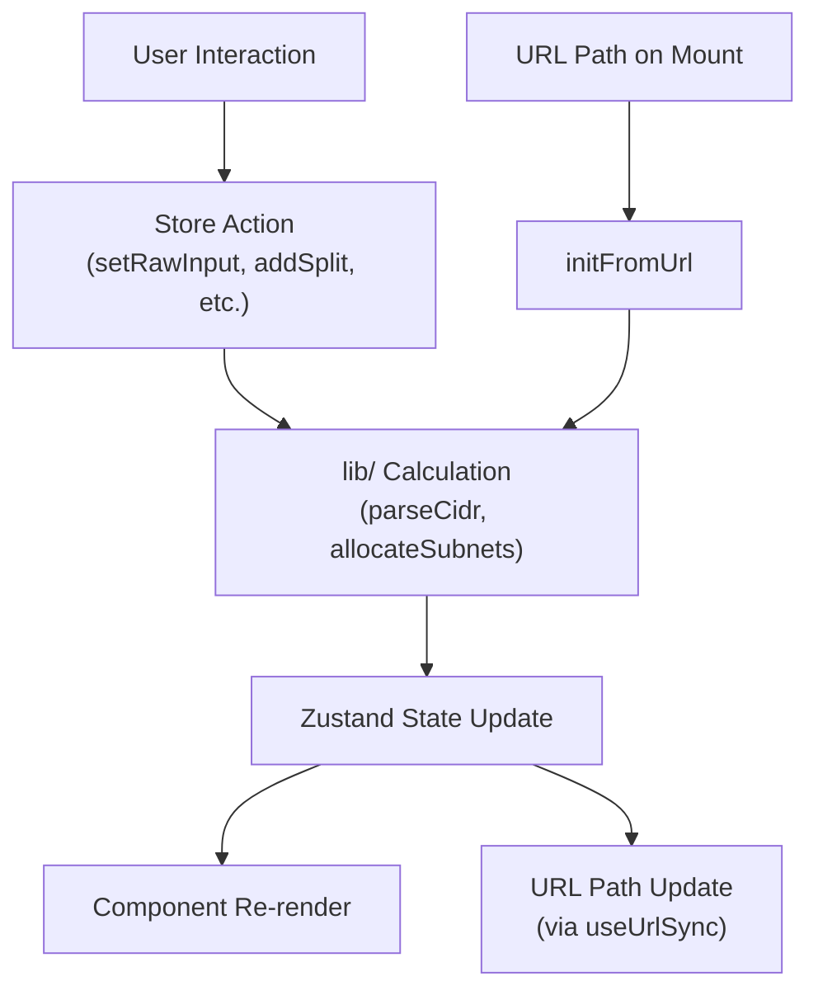
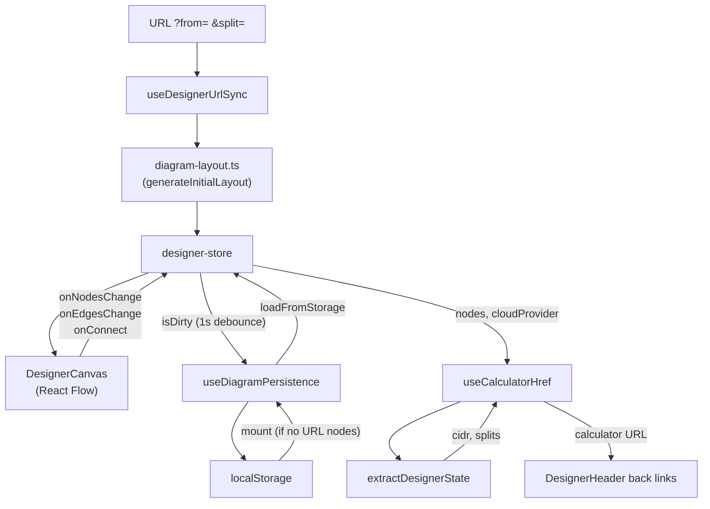

# State Management

subnet.fit uses three Zustand stores with no middleware. All state is held client-side.

## calculator-store.ts

The primary store holding all application state and actions.

### State Shape

```typescript
interface CalculatorState {
  // Calculator
  rawInput: string           // Last valid calculator CIDR/IP committed to the store
  result: CidrResult | null  // Parsed result (null if input is invalid)
  inputMode: 'guided' | 'cidr'  // CIDR input mode

  // Splitter (uses rawInput as the parent CIDR)
  splitPrefixes: number[]    // Ordered list of child prefix lengths
  splitLabels: string[]      // Editable label per split
  splits: SubnetSplit[]      // Computed allocation results
  remainingSpace: number     // Unallocated address count
  availablePrefixes: number[]// Prefix lengths that still fit

  // Supernet
  supernetInputs: string     // Raw textarea content (newline-separated CIDRs)
  supernetResult: string | null  // Computed supernet CIDR or null

  // UI surfaces
  activeDrawer: 'none' | 'supernet' | 'reference'
  commandPaletteOpen: boolean
  exportModalOpen: boolean   // Export & Share modal (trigger card, command palette, Cmd/Ctrl+E)

  // Supernet → calculator handoff (shows an undo notice in the input)
  handoff: { previous: string; next: string } | null
}
```

### Actions

| Action | Signature | Behavior |
|--------|-----------|----------|
| `setRawInput` | `(input: string) => void` | Update calculator input. Calls `parseCidr()` and stores the result. Recalculates or clears splits as needed, and clears any pending `handoff` on manual edits. |
| `setInputMode` | `(mode: 'guided' \| 'cidr') => void` | Switch the CIDR input mode. |
| `addSplit` | `(prefix: number) => void` | Append a new subnet with the given prefix. Auto-generates label "Subnet N". Triggers `recalcSplits`. |
| `removeSplit` | `(index: number) => void` | Remove a subnet by index. Triggers `recalcSplits`. |
| `updateSplitLabel` | `(index: number, label: string) => void` | Change a subnet's display label in both `splitLabels` and `splits`. |
| `updateSplitColor` | `(index: number, color: string) => void` | Change a subnet's colour in `splits`. |
| `resetSplits` | `() => void` | Clear all splits for the current parent CIDR. Triggers `recalcSplits`. |
| `setSupernetInputs` | `(inputs: string) => void` | Update supernet textarea. Parses lines and calls `findSmallestContainingCidr()` when >= 2 valid CIDRs are present. |
| `setActiveDrawer` | `(drawer) => void` | Open/close the Reference or Supernet drawer. |
| `setCommandPaletteOpen` | `(open: boolean) => void` | Toggle the command palette. |
| `setExportModalOpen` | `(open: boolean) => void` | Toggle the Export & Share modal. Opened by the trigger card, the `open-export` command, or `Cmd/Ctrl+E` (only when a result is loaded). |
| `loadSupernetResult` | `(cidr: string) => void` | Load a supernet result into the calculator and record a `handoff` of `{ previous, next }` so the user can undo. Used by the SupernetTool "View details" button. |
| `restoreHandoff` | `() => void` | Undo a supernet handoff — restores the previous CIDR and clears `handoff`. |
| `dismissHandoff` | `() => void` | Dismiss the handoff notice without restoring. |
| `initFromUrl` | `(cidr, splits?, labels?) => void` | Restore full state from URL. Used on mount by `useUrlSync`. |

### recalcSplits Helper

A module-level function (not part of the store) that encapsulates the recalculation pattern:

```typescript
function recalcSplits(parentCidr: string, prefixes: number[], labels: string[]) {
  const splits = allocateSubnets(parentCidr, prefixes, labels)
  const remaining = splits ? getRemainingSpace(parentCidr, splits) : 0
  const available = getAvailablePrefixes(parentCidr, splits ?? [])
  return { splits: splits ?? [], remainingSpace: remaining, availablePrefixes: available }
}
```

Called by `addSplit`, `removeSplit`, `resetSplits`, `setRawInput`, and `initFromUrl`. It sorts prefixes largest-first (ascending prefix length) for optimal VLSM packing before allocating.

### Initial State

The store initializes with the default CIDR from `config.defaultCidr` (default: `'10.0.0.0/16'`) for both calculator and splitter. The result is computed at module load time via `parseCidr(config.defaultCidr)`. To change the default, edit `src/lib/config.ts`.

## designer-store.ts

Manages the Network Designer diagram state. See the [Network Designer documentation](network-designer.md) for the full component architecture.

### State Shape

```typescript
interface DesignerState {
  nodes: Node<DesignerNodeData>[]     // All diagram nodes (subnet + resource)
  edges: Edge[]                        // All diagram edges
  selectedNodeId: string | null        // First selected node (drives properties panel)
  selectedNodeIds: string[]            // All selected nodes (drives arrange tools)
  isPaletteOpen: boolean               // Resource palette expanded/collapsed
  isDirty: boolean                     // Unsaved changes since last save/init
  isExportOpen: boolean                // Export modal visibility
}
```

`DesignerNodeData` is a discriminated union of `SubnetNodeData` (type `'subnet'`) and `ResourceNodeData` (type `'resource'`).

### Actions

| Action | Signature | Behavior |
|--------|-----------|----------|
| `setNodes` | `(nodes) => void` | Replace all nodes, mark dirty. Used by arrange tools. |
| `setEdges` | `(edges) => void` | Replace all edges, mark dirty. |
| `onNodesChange` | `(changes) => void` | Apply React Flow change events (drag, select, remove). |
| `onEdgesChange` | `(changes) => void` | Apply React Flow edge change events. |
| `onConnect` | `(connection) => void` | Create a new `networkEdge` between two nodes. |
| `addNode` | `(node) => void` | Append a node (from resource palette drag-and-drop). |
| `removeNode` | `(id) => void` | Remove a node and all edges where it is source or target. |
| `updateNodeLabel` | `(id, label) => void` | Update the `data.label` of any node type. |
| `updateNodeColor` | `(id, color) => void` | Update the `data.color` of a subnet node. No-op for resource nodes. |
| `clearDiagram` | `() => void` | Reset to empty state, clear localStorage key `subnet-designer-state`, reset selection. |
| `initFromLayout` | `(nodes, edges) => void` | Initialize from auto-generated layout (URL params), mark clean. |
| `setSelectedNodeId` | `(id) => void` | Set the primary selected node (opens properties panel). |
| `setSelectedNodeIds` | `(ids) => void` | Set all selected nodes (enables arrange tools). |
| `setIsPaletteOpen` | `(open) => void` | Toggle the resource palette sidebar. |
| `setExportOpen` | `(open) => void` | Toggle the export modal. |
| `loadFromStorage` | `(state) => void` | Restore nodes/edges from localStorage, mark clean. |

### Persistence

The designer store works with the `useDiagramPersistence` hook for auto-save:
- **Save**: Any state change that sets `isDirty: true` triggers a debounced (1s) write to `localStorage` key `subnet-designer-state`
- **Load**: On mount, if no URL params produced nodes, the hook loads from localStorage
- **Clear**: `clearDiagram()` also calls `localStorage.removeItem()`

### Selection Model

Two selection fields serve different purposes:
- `selectedNodeId` — The first selected node, drives the Properties Panel (Drawer opens/closes based on this)
- `selectedNodeIds` — All selected nodes, drives the Arrange Toolbar (align requires 2+, distribute requires 3+)

Both are set by the `onSelectionChange` callback from React Flow.

## theme-store.ts

Manages the dark/light theme.

### State Shape

```typescript
type Theme = 'light' | 'dark'

interface ThemeState {
  theme: Theme
  toggleTheme: () => void
  setTheme: (theme: Theme) => void
}
```

### Theme Detection Cascade

On initialization, the theme is determined by:

1. **localStorage** — Check for the key defined by `config.themeStorageKey`. If `'light'` or `'dark'`, use it.
2. **Config default** — Use `config.defaultTheme`, resolved via `resolveTheme()`. When set to `'system'`, this checks the `prefers-color-scheme: dark` media query.

### Theme Application

The `applyTheme()` function:
1. Adds or removes the `dark` class on `document.documentElement`
2. Writes the value to `localStorage` under the key from `config.themeStorageKey`

This runs immediately at module load (before any React render) and on every `toggleTheme`/`setTheme` call.

## State Flow Diagrams

### Calculator Flow



### Designer Flow



Both `useDesignerUrlSync` (after initialising from `?from=`/`?d=` params) and `useDiagramPersistence` (on every debounced save and on localStorage load) also rewrite the address bar to the canonical `/designer?from=&split=&provider=` URL via `buildDesignerUrl()` from `src/lib/designer-state-extract.ts`, so refresh and bookmarks keep the diagram context.

### Bidirectional Navigation (Calculator ↔ Designer)

State is preserved when navigating between the calculator and designer views:

**Calculator → Designer:**
- `Header.tsx`, `CommandPalette.tsx`, and `SplitterToolbar.tsx` read `rawInput`, `result`, and `splits` from `calculator-store`
- Always build `/designer?from={cidr}&split={cidr~label,...}` URL from current calculator state, emitting each subnet's **full CIDR** so exact ranges (including explicit/edited positions) survive the handoff
- `useDesignerUrlSync` handles merge: if a saved diagram exists with the same VPC CIDR, new subnets are merged in (preserving existing nodes, resources, and positions); otherwise a fresh layout is generated
- Falls back to bare `/designer` when no CIDR is loaded

**Designer → Calculator:**
- `useCalculatorHref()` hook reads `nodes` and `cloudProvider` from `designer-store`
- Calls `extractDesignerState()` to find VPC container CIDR and subnet container splits (prefix, label, and **full CIDR**)
- Calls `encodeState()` with `splitCidrs` to produce a calculator URL whose subnets keep their exact addresses, e.g. `/10.0.0.0/16?split=10.0.0.0/24~Web,10.0.4.0/24~DB` (the calculator builds splits via `buildSplitsFromCidrs` rather than re-packing)
- Falls back to `/` when no VPC container exists
- Used by the `DesignerHeader` logo, the single state-preserving back link (the duplicate "Calculator" button was removed)

### How URL Sync Works

The `useUrlSync` hook in `src/hooks/use-url-sync.ts` provides bidirectional synchronization:

**Mount (URL → store):**
1. `useEffect` with empty dependency array runs once on mount
2. Calls `migrateHashUrl()` to redirect any legacy hash-based URLs
3. Calls `readUrl()` to decode `window.location.pathname` + `window.location.search`
4. If a valid state is found, calls `initFromUrl()` to restore it
5. Supports network mode (CIDR with optional splits) and supernet mode

**Changes (store → URL):**
1. `useEffect` watches `rawInput`, `splitPrefixes`, `splitLabels`, `supernetInputs`, and `activeDrawer`
2. On change, calls `updateUrl()` which encodes the current state as a path + query string
3. Invalid direct CIDR drafts are held in `CidrInput` component state until they parse, so `rawInput` and the URL stay on the last valid value
4. Uses `history.replaceState()` — no browser navigation events are triggered

See [URL Sharing](url-sharing.md) for the URL format specification.
