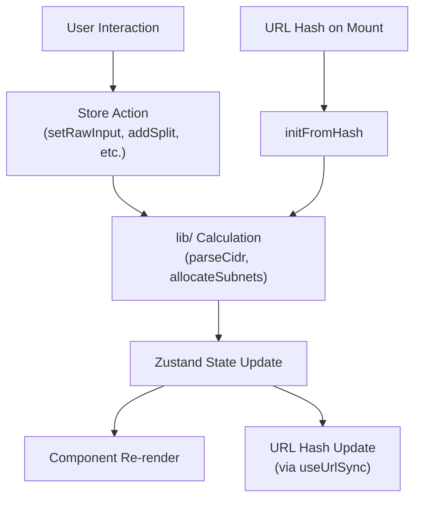

# State Management

subnet.fit uses two Zustand stores with no middleware. All state is held client-side.

## calculator-store.ts

The primary store holding all application state and actions.

### State Shape

```typescript
type AppTab = 'calculator' | 'splitter' | 'supernet' | 'reference'

interface CalculatorState {
  // Active tab
  activeTab: AppTab

  // Calculator
  rawInput: string           // Current text in the CIDR input field
  result: CidrResult | null  // Parsed result (null if input is invalid)

  // Splitter
  parentCidr: string         // Parent network CIDR string
  splitPrefixes: number[]    // Ordered list of child prefix lengths
  splitLabels: string[]      // Editable label per split
  splits: SubnetSplit[]      // Computed allocation results
  remainingSpace: number     // Unallocated address count
  availablePrefixes: number[]// Prefix lengths that still fit

  // Supernet
  supernetInputs: string     // Raw textarea content (newline-separated CIDRs)
  supernetResult: string | null  // Computed supernet CIDR or null
}
```

### Actions

| Action | Signature | Behavior |
|--------|-----------|----------|
| `setActiveTab` | `(tab: AppTab) => void` | Switch the active tab. |
| `setRawInput` | `(input: string) => void` | Update calculator input. Calls `parseCidr()` and stores the result. |
| `setParentCidr` | `(cidr: string) => void` | Update splitter parent. If valid, resets all splits and recalculates available prefixes. |
| `addSplit` | `(prefix: number) => void` | Append a new subnet with the given prefix. Auto-generates label "Subnet N". Triggers `recalcSplits`. |
| `removeSplit` | `(index: number) => void` | Remove a subnet by index. Triggers `recalcSplits`. |
| `updateSplitLabel` | `(index: number, label: string) => void` | Change a subnet's display label in both `splitLabels` and `splits`. |
| `resetSplits` | `() => void` | Clear all splits for the current parent CIDR. Triggers `recalcSplits`. |
| `setSupernetInputs` | `(inputs: string) => void` | Update supernet textarea. Parses lines and calls `findSmallestContainingCidr()` when >= 2 valid CIDRs are present. |
| `initFromHash` | `(cidr, tab?, splits?, labels?) => void` | Restore full state from URL hash. Used on mount by `useUrlSync`. |

### recalcSplits Helper

A module-level function (not part of the store) that encapsulates the recalculation pattern:

```typescript
function recalcSplits(parentCidr: string, prefixes: number[], labels: string[]) {
  const splits = allocateSubnets(parentCidr, prefixes, labels)
  const remaining = splits ? getRemainingSpace(parentCidr, splits) : 0
  const available = getAvailablePrefixes(parentCidr, splits ?? [])
  return { splits: splits ?? [], remainingSpace: remaining, availablePrefixes: available }
}
```

Called by `addSplit`, `removeSplit`, `resetSplits`, `setParentCidr`, and `initFromHash`.

### Initial State

The store initializes with `10.0.0.0/16` as the default CIDR for both calculator and splitter. The result is computed at module load time via `parseCidr('10.0.0.0/16')`.

## theme-store.ts

Manages the dark/light theme.

### State Shape

```typescript
type Theme = 'light' | 'dark'

interface ThemeState {
  theme: Theme
  toggleTheme: () => void
  setTheme: (theme: Theme) => void
}
```

### Theme Detection Cascade

On initialization, the theme is determined by:

1. **localStorage** — Check for `subnet-fit-theme` key. If `'light'` or `'dark'`, use it.
2. **System preference** — Check `prefers-color-scheme: dark` media query.
3. **Default** — Fall back to `'dark'`.

### Theme Application

The `applyTheme()` function:
1. Adds or removes the `dark` class on `document.documentElement`
2. Writes the value to `localStorage` under key `subnet-fit-theme`

This runs immediately at module load (before any React render) and on every `toggleTheme`/`setTheme` call.

## State Flow Diagram



### How URL Sync Works

The `useUrlSync` hook in `src/hooks/use-url-sync.ts` provides bidirectional synchronization:

**Mount (hash → store):**
1. `useEffect` with empty dependency array runs once on mount
2. Calls `readHash()` to decode `window.location.hash`
3. If a valid state is found, calls `initFromHash()` to restore it
4. Supports calculator mode (CIDR only) and splitter mode (CIDR + splits + labels)

**Changes (store → hash):**
1. `useEffect` watches `rawInput`, `activeTab`, `splitPrefixes`, `splitLabels`, `supernetInputs`, and `parentCidr`
2. On change, calls `updateHash()` which encodes the current state
3. Uses `history.replaceState()` — no browser navigation events are triggered

See [URL Sharing](url-sharing.md) for the hash format specification.
