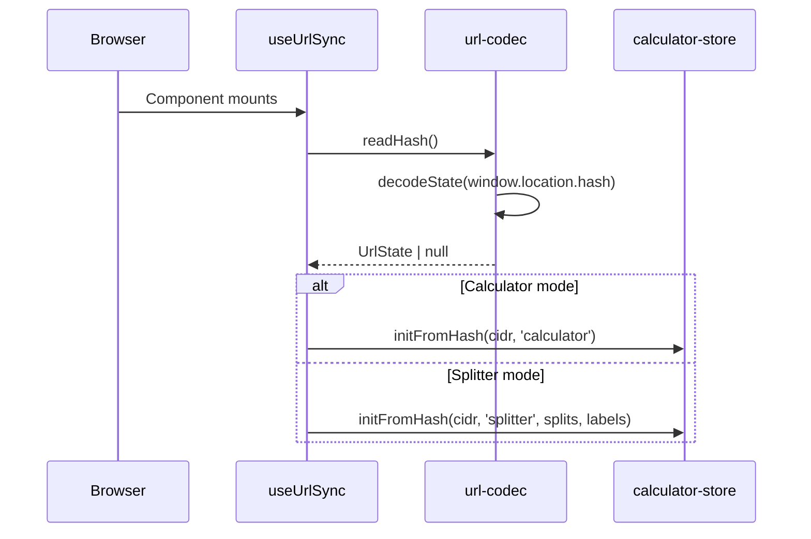
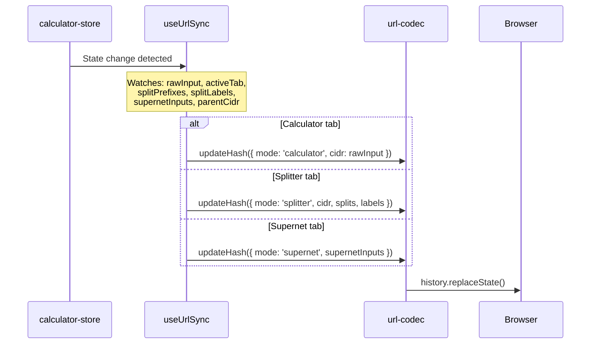

# URL Sharing & State Persistence

subnet.fit encodes application state in the URL hash, making every configuration shareable by copying the URL. No server is involved — the hash is decoded client-side on page load.

## Hash Format Specification

### Calculator Mode

```
#<ip>/<prefix>
```

The CIDR notation is used directly as the hash.

**Examples:**
- `#10.0.0.0/16`
- `#192.168.1.0/24`
- `#172.16.0.0/12`

### Splitter Mode

```
#split:<parent-cidr>:<prefix~label,prefix~label,...>
```

Components:
- `split:` — Mode prefix
- `<parent-cidr>` — Parent network in CIDR notation
- `:` — Separator
- `<prefix~label>` — Child prefix length, optionally followed by `~` and a URL-encoded label
- `,` — Separator between child entries

**Examples:**
- `#split:10.0.0.0/16:24~Web,25~API,26~Database`
- `#split:192.168.0.0/16:24,24,24` (uses default labels)
- `#split:10.0.0.0/8:16~Production,16~Staging`

### Supernet Mode

```
#super:<cidr>,<cidr>,...
```

Components:
- `super:` — Mode prefix
- Comma-separated list of CIDR notations

**Examples:**
- `#super:10.0.0.0/24,10.0.1.0/24`
- `#super:192.168.0.0/24,192.168.1.0/24,192.168.2.0/24`

## UrlState Type

```typescript
interface UrlState {
  mode: 'calculator' | 'splitter' | 'supernet'
  cidr: string
  splits?: number[]
  splitLabels?: string[]
  supernetInputs?: string[]
}
```

## Label Encoding

Labels support arbitrary text through URL encoding:
- On encode: `encodeURIComponent(label)` handles special characters
- On decode: `decodeURIComponent(encoded)` restores the original text, with a fallback to the raw string if decoding fails
- Labels are separated from their prefix by `~`
- If no `~` is present in a segment, the default label `"Subnet N"` is used

## Encoding/Decoding Functions

### encodeState(state: UrlState) → string

Produces the hash string (without the leading `#`):

- **Calculator:** Returns `state.cidr` directly
- **Splitter:** Builds `split:<cidr>:<segments>` where each segment is `prefix` or `prefix~encodedLabel`
- **Supernet:** Builds `super:<cidr1>,<cidr2>,...`

### decodeState(hash: string) → UrlState | null

Parses a hash string (with or without leading `#`):

1. Strip leading `#` and trim whitespace
2. If empty, return `null`
3. If starts with `split:` — parse splitter format
4. If starts with `super:` — parse supernet format
5. Otherwise — treat as calculator mode CIDR

### updateHash(state: UrlState) → void

Encodes the state and writes it to the URL:

```typescript
window.history.replaceState(null, '', `#${encoded}`)
```

Uses `replaceState` (not `pushState`) to avoid polluting browser history.

### readHash() → UrlState | null

Reads and decodes `window.location.hash`.

## useUrlSync Hook

The `useUrlSync` hook in `src/hooks/use-url-sync.ts` provides bidirectional sync between the Zustand store and the URL hash.

### Mount: Hash → Store



Runs once on mount via `useEffect(() => { ... }, [])`.

### Changes: Store → Hash



Runs on every relevant state change via `useEffect` with a dependency array.

## initFromHash Flow

When restoring from a URL hash, the `initFromHash` store action:

1. Calls `parseCidr(cidr)` to compute the calculator result
2. Sets `rawInput`, `result`, and `activeTab`
3. If in splitter mode with splits:
   - Sets `parentCidr`, `splitPrefixes`, `splitLabels`
   - Calls `recalcSplits()` to compute `splits`, `remainingSpace`, and `availablePrefixes`
   - Merges all computed values into the state
