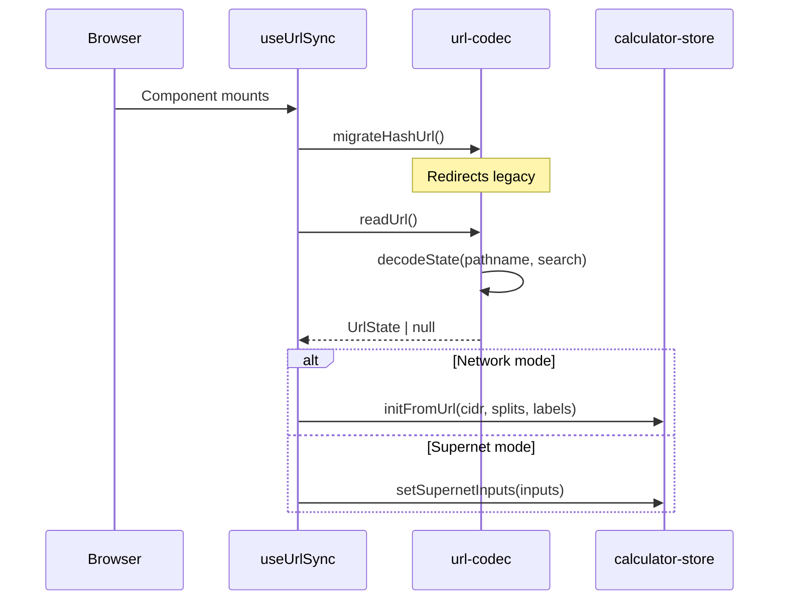
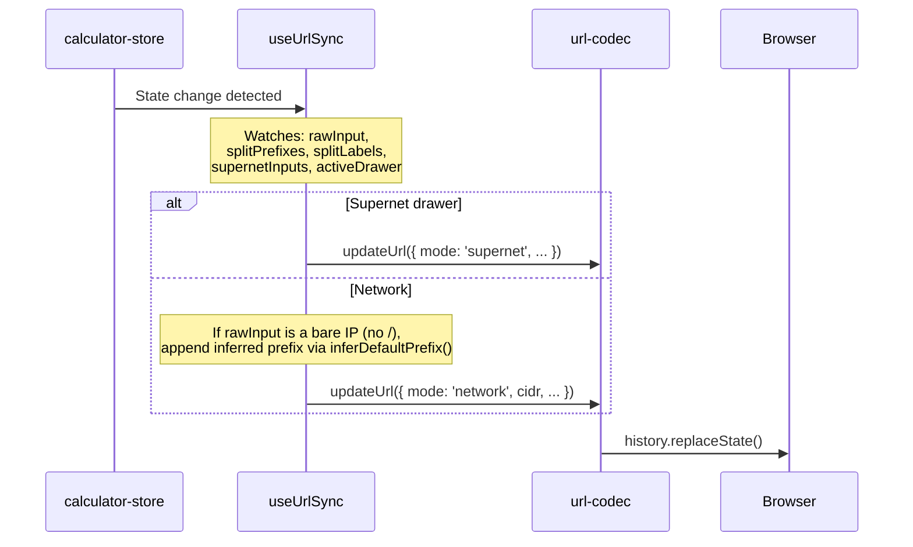

# URL Sharing & State Persistence

subnet.fit encodes application state in the URL path and query string, making every configuration shareable by copying the URL. No server is involved — the path is decoded client-side on page load.

## URL Format Specification

### Calculator Mode

```
/<ip>/<prefix>
```

The CIDR notation is used directly as the path.

**Examples:**
- `/10.0.0.0/16`
- `/192.168.1.0/24`
- `/172.16.0.0/12`

#### Bare IP URLs

Bare IPs (without a prefix) are also accepted. The prefix is inferred from the IP's trailing-zero structure using `inferDefaultPrefix()`:

| URL path | Inferred CIDR | Reason |
|----------|---------------|--------|
| `/10.0.0.0` | `10.0.0.0/8` | `.0.0.0` → `/8` |
| `/10.10.0.0` | `10.10.0.0/16` | `.0.0` → `/16` |
| `/192.168.1.0` | `192.168.1.0/24` | `.0` → `/24` |
| `/8.8.8.8` | `8.8.8.8/32` | No trailing zeros → `/32` |

On load, bare IP URLs are normalized to include the inferred prefix (e.g. `/8.8.8.8` becomes `/8.8.8.8/32` in the address bar).

### Splitter Mode

```
/<ip>/<prefix>?split=<prefix~label,prefix~label,...>
```

Components:
- `/<ip>/<prefix>` — Parent network in CIDR notation as the path
- `?split=` — Query parameter containing child subnets
- `<prefix~label>` — Child prefix length, optionally followed by `~` and a URL-encoded label
- `,` — Separator between child entries

**Examples:**
- `/10.0.0.0/16?split=24~Web,25~API,26~Database`
- `/192.168.0.0/16?split=24,24,24` (uses default labels)
- `/10.0.0.0/8?split=16~Production,16~Staging`

### Supernet Mode

```
/super?nets=<cidr>,<cidr>,...
```

Components:
- `/super` — Fixed path for supernet mode
- `?nets=` — Query parameter with comma-separated CIDR notations

**Examples:**
- `/super?nets=10.0.0.0/24,10.0.1.0/24`
- `/super?nets=192.168.0.0/24,192.168.1.0/24,192.168.2.0/24`

### Designer Mode

```
/designer
/designer?from=<cidr>&split=<prefix~label,prefix~label,...>
```

Components:
- `/designer` — Fixed path for designer mode
- `?from=` — Optional parent CIDR to auto-generate a diagram from
- `&split=` — Optional child subnets (same format as splitter mode)

**Examples:**
- `/designer` — Empty canvas (loads from localStorage if available)
- `/designer?from=10.0.0.0/16&split=24~Web,25~API` — Auto-generates Internet Gateway → VPC → Subnet nodes

When URL parameters are present, they take precedence over any saved localStorage diagram. The `useDesignerUrlSync` hook reads these params and calls `generateInitialLayout()` from `diagram-layout.ts`.

### Bidirectional Navigation

Navigation between the calculator and designer preserves state in both directions using URL parameters:

**Calculator → Designer:**
- The Header "Designer" link and command palette "Open Designer" command build `/designer?from={cidr}&split={prefix~label,...}` from calculator store state — but only when no saved diagram exists in localStorage. If a saved diagram exists, they link to bare `/designer` so persistence restores the full state (including any resources the user added)
- The SplitterToolbar "Open in Designer" button always carries params as an explicit "generate new diagram" action
- Falls back to bare `/designer` when no CIDR is loaded

**Designer → Calculator:**
- The `useCalculatorHref()` hook in `src/hooks/use-calculator-href.ts` extracts CIDR and splits from designer nodes using `extractDesignerState()` from `src/lib/designer-state-extract.ts`
- Finds the first `vpc-container` node for the parent CIDR
- Collects all `subnet-container` nodes for split prefixes and labels
- Encodes the result as a calculator URL via `encodeState()` (e.g. `/10.0.0.0/16?split=24~Web,25~API`)
- Falls back to `/` when no VPC container exists in the diagram
- Used by `DesignerHeader` logo/back button and `DesignerPage` mobile fallback

## UrlState Type

```typescript
interface UrlState {
  mode: 'network' | 'supernet'
  cidr: string
  splits?: number[]
  splitLabels?: string[]
  supernetInputs?: string[]
}
```

## Label Encoding

Labels support arbitrary text through URL encoding:
- On encode: `encodeURIComponent(label)` handles special characters
- On decode: `decodeURIComponent(encoded)` restores the original text, with a fallback to the raw string if decoding fails
- Labels are separated from their prefix by `~`
- If no `~` is present in a segment, the default label `"Subnet N"` is used

## Encoding/Decoding Functions

### encodeState(state: UrlState) → string

Produces the URL path + query string:

- **Network (no splits):** Returns `/<cidr>` (e.g. `/10.0.0.0/16`)
- **Network (with splits):** Returns `/<cidr>?split=<segments>` where each segment is `prefix` or `prefix~encodedLabel`
- **Supernet:** Returns `/super?nets=<cidr1>,<cidr2>,...`

### decodeState(pathname: string, search: string) → UrlState | null

Parses a pathname and search string:

1. Strip leading `/` and trim whitespace
2. If empty, return `null` (home page)
3. If path is `super` — parse supernet format from `?nets=` query param
4. If path matches CIDR pattern (`ip/prefix`) — parse as network mode, optionally with `?split=` query param
5. If path matches bare IP pattern (`ip` without prefix) — validate with `parseIPv4()`, infer prefix via `inferDefaultPrefix()`, construct full CIDR, and continue as network mode (with optional `?split=`)
6. Otherwise — return `null`

### updateUrl(state: UrlState) → void

Encodes the state and writes it to the URL:

```typescript
window.history.replaceState(null, '', encodedPath)
```

Uses `replaceState` (not `pushState`) to avoid polluting browser history.

### readUrl() → UrlState | null

Reads and decodes `window.location.pathname` + `window.location.search`.

## Legacy Hash URL Migration

The `migrateHashUrl()` function provides backward compatibility with old hash-based URLs. On mount, `useUrlSync` calls this before reading the current URL.

**Supported legacy formats:**
- `#10.0.0.0/16` → `/10.0.0.0/16`
- `#10.0.0.0/16:24~Web,25~API` → `/10.0.0.0/16?split=24~Web,25~API`
- `#split:10.0.0.0/16:24~Web,25~API` → `/10.0.0.0/16?split=24~Web,25~API`
- `#super:10.0.0.0/24,10.0.1.0/24` → `/super?nets=10.0.0.0/24,10.0.1.0/24`

The migration uses `history.replaceState()` so the old hash URL is replaced in-place without a page reload.

## useUrlSync Hook

The `useUrlSync` hook in `src/hooks/use-url-sync.ts` provides bidirectional sync between the Zustand store and the URL.

### Mount: URL → Store



Runs once on mount via `useEffect(() => { ... }, [])`.

### Changes: Store → URL



Runs on every relevant state change via `useEffect` with a dependency array.

## initFromUrl Flow

When restoring from a URL, the `initFromUrl` store action:

1. Calls `parseCidr(cidr)` to compute the calculator result
2. Sets `rawInput` and `result`
3. If splits are present:
   - Sets `splitPrefixes` and `splitLabels`
   - Calls `recalcSplits()` to compute `splits`, `remainingSpace`, and `availablePrefixes`
   - Merges all computed values into the state
